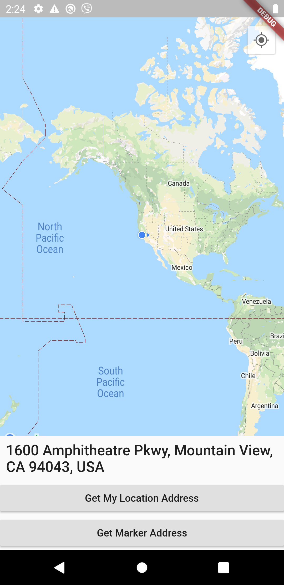
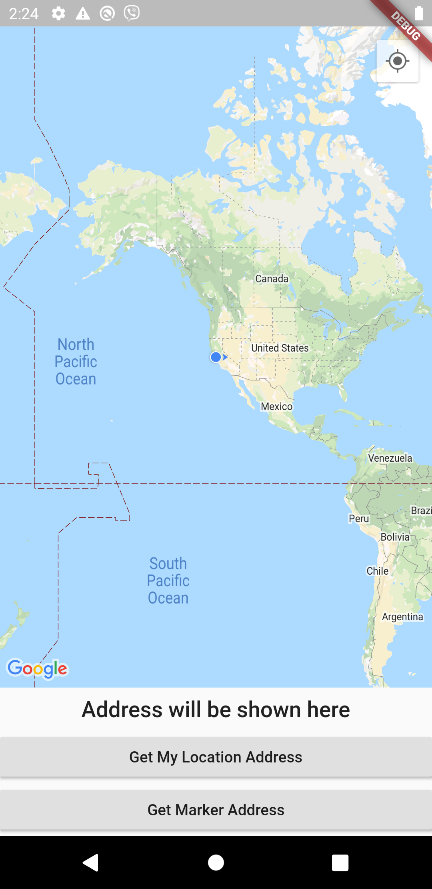

# maps

A bare bones reverse geocoding app in flutter that allows the user to know his current address as well as any address on the map.
Features: 

    1. Ask user location permission
    
    2. Get current user location.
    
    3. Show current user location on the map.
    
    4. Tap to add a marker to the map.
    
    5. Get full address of a marker.
    

Result:
    
    
    

## Getting Started

This project is a starting point for a Flutter application.

A few resources to get you started if this is your first Flutter project:

- [Lab: Write your first Flutter app](https://flutter.dev/docs/get-started/codelab)
- [Cookbook: Useful Flutter samples](https://flutter.dev/docs/cookbook)

For help getting started with Flutter, view our
[online documentation](https://flutter.dev/docs), which offers tutorials,
samples, guidance on mobile development, and a full API reference.......
